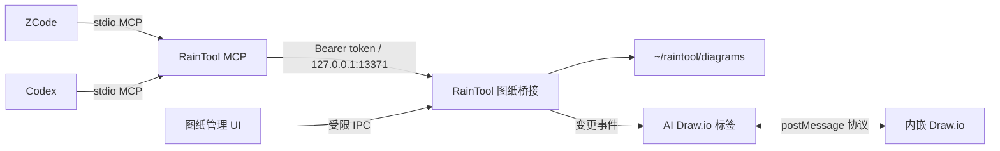

# RainTool 图纸管理与 MCP 接入

## 能力边界

RainTool 现在把 Draw.io XML 作为一等业务数据管理。AI Draw.io、用户手工编辑、
ZCode 和 Codex 看到的是同一个 `diagramId` 和同一条版本链，而不是四份互不相干
的浏览器会话。



职责划分如下：

- RainTool 负责图纸身份、标题、收藏、标签、来源、版本、复制、删除、打开和持久化。
- 内嵌的 `next-ai-draw-io` 继续负责 AI 会话、模型供应商和 Draw.io 编辑器；它通过
  `raintool-diagram-v1` 桥接当前 XML，不再是图纸唯一的数据源。
- MCP 保留上游的 XML 校验、按 `mxCell id` 编辑、多页和内容指纹保护；传输层改成
  RainTool 本地桥接，并额外提供布局检查与预览复核。
- ZCode/Codex 只能调用声明好的图纸方法，不能通过 MCP 向 Electron 传入任意命令、
  端口或应用内文件路径。

## 用户操作

在 **AI 工具 → 图纸管理** 中可以搜索、新建、打开、重命名、复制、收藏、查看历史、
恢复历史和删除图纸。一个图纸只能对应一个已打开标签；再次打开会聚焦原标签。

AI 画图标签顶部的 **复制此页** 会复制持久化 XML 并生成新的 `diagramId`，因此之后
修改副本不会影响原图。**收藏此页** 同时加入 RainTool 收藏夹并设置图纸收藏状态，
重启后仍然有效。

旧版 `next-ai-draw-io` IndexedDB 中带图纸的会话会在首次打开新版编辑器时迁移：

- 只迁移 `diagramXml`、标题和时间，不复制聊天消息或 API Key；
- 用旧 `sessionId` 去重，重复启动不会重复导入；
- 原 IndexedDB 数据不会自动删除，可在确认迁移结果后由用户自行清理。

## 数据和并发

默认数据目录：

```text
~/raintool/
├── mcp-auth.json                  # 0600，仅含本机桥接地址和随机 token
└── diagrams/
    ├── index.json                 # 图纸元数据索引
    └── <diagramId>/
        ├── diagram.drawio         # 当前 XML
        └── revisions/
            └── <revision>.drawio  # 最近 20 个内容版本
```

索引和 XML 都通过同目录临时文件再原子重命名。单张 XML 上限为 12 MB。所有写入在
RainTool 主进程串行完成；编辑器和 MCP 写入时携带 `expectedRevision`。如果用户刚刚
手工修改过图纸，过期的 MCP 写入会收到 `REVISION_CONFLICT`，不会覆盖新内容。
MCP 的 `edit_diagram` 使用内容指纹而不是 60 秒时限：只要图纸内容没有在 Agent 未知的
情况下变化，就允许继续增量编辑；用户手工修改后会要求 Agent 重新 `get_diagram`。

## MCP 工具

兼容上游工作流的工具：

| 工具 | 用途 |
| --- | --- |
| `start_session` | 新建持久化图纸并在 RainTool 中打开 |
| `create_new_diagram` | 用完整 XML 初始化/替换当前图纸；默认只允许小型骨架 |
| `load_diagram` | 读取普通或压缩 `.drawio` 文件并载入全部页面 |
| `get_diagram` | 获取包含用户最新手工修改的 XML |
| `edit_diagram` | 按 `mxCell id` 分批增、改、删，带内容指纹保护 |
| `list_pages` / `add_page` / `rename_page` / `delete_page` | 多页图纸管理；复杂场景应拆页 |
| `inspect_diagram` | 检查缺失引用、几何、悬空边、重叠、过密、越界和文本密度；带 `sourcePoint/targetPoint` 的时序图箭头是合法的；节点重叠是不可豁免的错误 |
| `preview_diagram` | 渲染 PNG/SVG 到本地，供 Codex/ZCode 视觉复核 |
| `finalize_diagram` | 仅当前版本已检查且无结构错误时标记完成；文字/密度等警告保留为建议 |
| `export_diagram` | 导出 `.drawio`、PNG 或 SVG |

管理工具：`list_diagrams`、`open_diagram`、`duplicate_diagram`、
`update_diagram_metadata`、`delete_diagram`、`list_diagram_revisions`、
`restore_diagram_revision`。

建议给智能体的指令示例：

> 调用 RainTool MCP，新建一张“支付链路”流程图并实时打开。先画骨架，再按场景分批补全；
> 复杂场景拆成多个页面。每次大改后检查图纸，导出预览进行视觉复核；通过后才完成图纸。

## 配置 ZCode

安装后的 MCP 启动器位于：

```text
/Applications/RainTool.app/Contents/Resources/raintool-mcp/raintool-mcp
```

在 `~/.zcode/cli/config.json` 中合并以下配置，保留已有 `plugins` 等字段。ZCode 配置
使用 `mcp.servers`，`command` 必须是字符串，参数放在 `args`；配置文件不会展开
`${...}`，所以必须使用绝对路径。

```json
{
  "mcp": {
    "servers": {
      "raintool": {
        "type": "stdio",
        "command": "/Applications/RainTool.app/Contents/Resources/raintool-mcp/raintool-mcp",
        "args": ["--client", "zcode"],
        "enabled": true,
        "timeoutMs": 60000
      }
    }
  }
}
```

重启 ZCode 会话，在 **Settings → MCP** 确认 `raintool` 已连接且显示 20 个工具。

## 配置 Codex

```bash
codex mcp add raintool -- \
  /Applications/RainTool.app/Contents/Resources/raintool-mcp/raintool-mcp \
  --client codex
codex mcp list
```

如果存在同名旧配置，先执行 `codex mcp remove raintool`。配置生效后需新建或重启
Codex 任务，让任务重新发现 MCP 工具。MCP 首次调用时会尝试打开 RainTool；如 macOS
阻止自动打开，先手动启动 RainTool 再重试。

## 构建与验证

```bash
npm run build:mcp
npm run verify:mcp
npm run test:diagrams
npm run build
npm run build:electron
npm run dist
```

`verify:mcp` 会真实完成 MCP 初始化和工具发现，并拒绝 stdout 上的非协议输出。
`test:diagrams` 覆盖持久化、重启读取、复制、历史恢复、版本冲突、旧数据幂等迁移，
以及 MCP 创建/读取/编辑/导出同一张 RainTool 图纸、多页和质量门。打包验证还检查应用内 MCP 启动器、
单文件服务和依赖许可证。

2026-07-17 的 MCP 生产依赖审计仍会报告 6 项（2 moderate、4 high），均来自
MCP SDK 的 HTTP/Hono 传输依赖，esbuild metafile 证明它们没有进入 stdio 单文件。
实际 bundle 中原本可达的 AJV/fast-uri 已覆盖到 `8.20.0`/`4.1.0`，重新审计和测试
通过。升级 SDK 时必须重新核对 metafile，不能只看完整安装树或盲目运行
`npm audit fix --force`。

## 备份、恢复和故障排查

退出 RainTool 后备份整个 `~/raintool/diagrams` 即可。恢复时也应先退出应用，再整体
替换该目录；不要只复制 `index.json` 或单独复制 XML。`mcp-auth.json` 不必备份，删除
后 RainTool 会生成新 token，MCP 客户端会从固定文件重新读取。

- MCP 显示连接关闭：确认启动器存在且可执行，然后直接运行它查看 stderr。
- MCP 能列图但不能打开：确认 RainTool 已运行，且没有别的进程占用 `127.0.0.1:13371`。
- `REVISION_CONFLICT`：重新调用 `get_diagram`，基于新 XML 重新构造修改。
- PNG/SVG 导出超时：保持目标图纸的 RainTool 编辑标签已加载；`.drawio` 导出不依赖渲染器。
- 图纸编辑器启动失败：按 `docs/ai-drawio-integration.md` 中的 `13370` 服务故障处理。

升级上游 `next-ai-draw-io` 前必须阅读 `docs/ai-drawio-upgrade.md`，重新合并页面桥接和
MCP XML 算法，不能用新快照直接覆盖 RainTool 适配文件。
